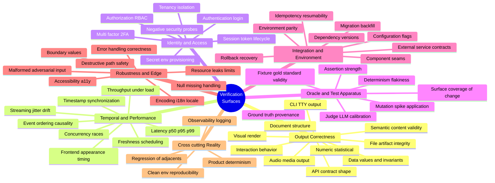

# Verification Surface Atlas

The reference an agentic tester consults to answer one question on every "done":
**given what changed, which independent ways could this be wrong, and what would
actually prove it isn't?**

This is the breadth half of `proof-of-done`. The gate (Stop hook) decides *when* to
verify; this atlas decides *what* the verification has to cover. It exists because
the failure modes developers actually hit are far more diverse than "did the test
pass" — and the most expensive ones live in the test apparatus itself.

---

## The spine: it's an oracle problem

To verify anything, *something* has to know the right answer — a test, a fixture, a
judge, an acceptance rule. That something is the **oracle**. Almost every false
"done" traces back to a wrong or weak oracle, not a wrong product:

- a regex is a vacuous oracle for "is this a good faculty URL" — it answers "is this
  string URL-shaped," which is a different question;
- a gold-standard set of clinical-trial protocols is worthless as an oracle if the
  documents pulled were the wrong type or caliber;
- a spiked test file proves nothing if the spike never actually changed the bytes;
- an LLM judge is an oracle that can be miscalibrated, inconsistent, or sycophantic.

So the atlas has seven families, and the fourth — **Oracle & Test Apparatus** — is
the one most teams under-enumerate and the one that catches your hardest cases. An
agentic verifier must be willing to distrust its own measuring instrument.

**Orthogonal** here means independent: a change can be correct on every other axis
and still fail one of these, so each has to be checked on its own terms. A typical
change exposes 2–5 axes; the agent's job is to name *which*, demand proof for each,
and report BLOCKED when it can't reach one rather than emitting a green check.

---

## The map

(The same diagram is in `verification-surfaces.mermaid` for editing.)

---

## Family A — Output correctness

What the change *produced*. The trap across this whole family: **format-valid is not
correct**. Something can parse, return 200, or match a pattern and still be wrong.

| Dimension | Where a false "done" hides | Proof that counts |
|---|---|---|
| Visual / render | builds clean, nobody looked at the pixels | screenshot vs baseline, or a vision judgment of the live UI |
| Interaction / behavior | units pass, the click-through flow breaks at a seam | drive the real UI by intent, end-to-end; assert state at each step |
| Data values & invariants | schema valid, values wrong (bad join, dropped/dup rows) | row-count delta vs baseline + uniqueness, FK, null-rate, distribution drift |
| Semantic content validity | matches regex / MIME but isn't what was asked for | content assertions: *is it really* a Phase-III protocol, after date X, with sections Y |
| API / contract | 200 returned but body shape, pagination, or downstream effect wrong | assert status **and** schema **and** the state that should have changed |
| CLI / TTY | exit 0, the rendered output is garbled | freeze the terminal; assert on rendered text, not just exit code |
| Audio / media | file written but silent, wrong duration, wrong channels | probe duration + RMS energy (non-silent) + sample rate; optional transcript round-trip |
| File / artifact integrity | file exists but empty, truncated, wrong type, or identical to source | magic-byte type check, size floor, `hash ≠ source`, actually open/parse it |
| Numeric / statistical | runs, but units/sign/rounding/off-by-one wrong | recompute independently; reconcile totals; sanity-check sign and units |
| Document structure | doc opens but TOC/headings/pagination malformed | parse the structure; assert heading tree, page count, no broken refs |

---

## Family B — Temporal & performance

Usually collapsed into "performance," but these are several independent axes. A
result can be **correct in value yet wrong in time** — and timing bugs are invisible
until you measure them explicitly.

| Dimension | Where a false "done" hides | Proof that counts |
|---|---|---|
| Latency | "works" on a warm cache; p95/p99 blows the budget | measure p50/p95/p99 under realistic load against a stated budget |
| Timestamp synchronization | data right, stamped to the wrong moment (waveform not aligned to the sung note) | assert `event_time ≈ source_time` within tolerance; overlay signal vs ground-truth clock |
| Event ordering / causality | all events present, out of order; a read races a write | assert ordering invariants; read-after-write inside the consistency window |
| Throughput / volume | fine at 10 rows, dies at 10M | run at production scale; watch time and memory growth |
| Concurrency / races | passes single-threaded; double-submit corrupts state | do it twice at once, with stale state underneath |
| Streaming jitter / drift | aligned at second 5, drifts by minute 5 | measure drift over a long run, not a short clip |
| Freshness / scheduling | job is green but produced no new rows today | assert `max(timestamp)` within the expected window even when the job "succeeded" |
| Frontend appearance timing | element eventually shows, but too late or flickering | assert appearance within N ms; capture the latency of the visible occurrence |

---

## Family C — Identity & access

Mostly **negative** testing: the right principal must pass *and* the wrong one must
be denied. Both directions are surfaces, and the denial direction is the one that's
usually skipped.

| Dimension | Where a false "done" hides | Proof that counts |
|---|---|---|
| Authentication | the one hardcoded happy-path login works | drive the real login; assert authenticated state, not just a 200 |
| Authorization / RBAC | admin path tested; denial path never checked | positive *and* negative: a wrong-role user must be blocked |
| Session / token lifecycle | works until the token expires mid-flow (or a middlebox caps the connection) | exercise expiry + refresh; run a session past the cap |
| Multi-factor / 2FA | bypassed in tests by a backdoor flag | drive a real TOTP in a test account; confirm the gate actually gates |
| Secret / env provisioning | works on your machine; a missing `.env` var silently falls back to a wrong default | assert required secrets are present *and used*; fail loud on missing |
| Tenancy isolation | user A's data is fine; user B can also see it | cross-tenant negative probe |
| Negative security | happy path only; injection / XSS / path-traversal unprobed | adversarial inputs at each entry point |

---

## Family D — Oracle & test apparatus *(the crux)*

This family verifies the **measuring instrument**, not the product. It's where your
listed cases actually live, and it's the cheapest place in the whole stack to be
fooled — because a broken oracle manufactures false PASS *at scale*, silently.

**Fixture / gold-standard validity.** Calibration is only as good as the gold set.
If the "clinical-trial protocols" scraped from the web were the wrong document type
or caliber, every spiked-defect number computed against them is noise — the work
isn't slightly off, it's meaningless. Mandate: validate each fixture against the
*real* acceptance criteria (document type, trial phase, date window, required
sections), not "it's a PDF." Quarantine fixtures that fail and refuse to calibrate
on them.

**Mutation / spike application.** Injecting a defect only tests anything if the
mutant actually differs from the original. If spiked files came out byte-identical
to the source, a "pass" means you tested nothing. Mandate: after spiking, assert
`hash(spiked) ≠ hash(original)` *and* that the specific injected defect is present
and detectable; fail the calibration run if any spike is a no-op. (This is the
classic equivalent-mutant / unapplied-mutant failure mode from mutation testing.)

**Judge / LLM-oracle calibration.** When the verdict is an LLM judge, the judge is
itself a fallible oracle — it can be wrong, inconsistent across runs, or
sycophantic. Mandate: check agreement against a human-labeled slice, consistency
under repetition (same input → same verdict), and resistance to obvious distractors.
Track judge drift when the prompt or model changes. An uncalibrated judge is the
highest-leverage false-positive generator you have.

**Surface coverage of the change.** Did verification touch what changed, or just
re-run CI? If every step is build / typecheck / run-existing-tests, you planned a CI
rerun, not a verification. Mandate: find the step that reaches the changed surface,
or report BLOCKED.

**Assertion strength.** A check that asserts nothing meaningful ("no exception
thrown") is a vacuous PASS — the regex-as-URL-oracle problem in general form.
Mandate: every check must be *able to fail*. Confirm it goes red on a deliberately
broken input before its green is trusted.

**Determinism / flakiness.** A flaky check carries no signal. Run suspect checks N
times; one that flips gets quarantined, not counted.

**Ground-truth provenance / contamination.** Where did the gold come from, is it
stale, and could the system under test have been trained on it? An oracle drawn from
the same source as the output isn't independent and will rubber-stamp it.

---

## Family E — Integration & environment

The product is correct in pieces and in your environment; it breaks at the seams or
somewhere that isn't your machine.

| Dimension | Where a false "done" hides | Proof that counts |
|---|---|---|
| Component seams | pieces pass alone, the flow breaks where they join | end-to-end through the real interface |
| Environment parity | green on the dev VM, broken on prod (VPN/WSL routing, libc, paths) | run in a prod-like environment; pin the differences |
| Dependency versions | works with your lockfile; a transitive bump breaks it | clean-install from lock; test the resolved versions |
| Configuration / flags | default config tested; the flag combo users actually run isn't | matrix the meaningful flag combinations |
| External-service contracts | a third party returns 200 even when it didn't process | assert the real downstream effect, not the call's status code |
| Idempotency / resumability | one clean run works; re-run or resume-from-checkpoint dupes or corrupts | run twice; kill mid-run and resume; assert identical end state |
| Migration / backfill | schema migrated; old rows never backfilled | assert historical rows conform after the migration |
| Rollback / recovery | happy path only; a mid-flow failure leaves partial state | inject a mid-flow failure; assert clean recovery |

---

## Family F — Robustness & edge

The center of the input space works; the edges and the adversarial inputs don't.

| Dimension | Where a false "done" hides | Proof that counts |
|---|---|---|
| Error handling | wrong input silently swallowed, or the wrong error raised | assert the error fires *and names the actual problem* |
| Boundary values | mid-range works; empty / zero / max / off-by-one breaks | test the edges explicitly |
| Malformed / adversarial | clean input only; garbage or oversized payload unhandled | fuzz the entry points |
| Null / missing | populated case works; the null path NPEs or silently drops rows | exercise null/missing for every field |
| Encoding / i18n | ASCII works; unicode, RTL, timezone, or locale breaks | test non-ASCII, multiple locales, TZ boundaries |
| Accessibility | renders, but unusable by keyboard / screen reader / low contrast | a11y checks + a keyboard-only pass |
| Destructive-path safety | drives a live delete / send / publish with no safe target | require a dry-run or sandbox before driving destructive paths |
| Resource leaks / limits | one iteration is fine; leaks handles or memory over many | repeat N times; watch RSS and file-descriptor growth |

---

## Family G — Cross-cutting reality

The checks that keep the other six honest.

| Dimension | Where a false "done" hides | Proof that counts |
|---|---|---|
| Product determinism | flaky output mistaken for a correct one | same input → same output where expected; pin the nondeterminism |
| Observability | failure is invisible because nothing logs or emits | assert the failure path is logged/metered so it's catchable |
| Regression of adjacents | the diff's target works; it broke the neighbor | probe the adjacent paths the refactor touched, not just the changed one |
| Clean-env reproducibility | "works on my machine"; a cold start fails | build and run from a clean checkout or container |

---

## Worked examples — your repos mapped to axes

| What happened | Axes it actually was |
|---|---|
| Faculty URL passes regex/pytest but is dead or wrong | A · semantic content validity + a liveness fetch (assert reachable + expected content); **D · assertion strength** — the regex was a vacuous oracle for "good URL" |
| Clinical-trial gold standards were the wrong type/caliber, wasting all calibration | **D · fixture validity** + **D · provenance** + A · semantic validity with nuanced criteria (phase, date, required sections) |
| Spiked documents came out byte-identical to the source, assumed good | **D · mutation/spike application** — assert `hash ≠ source` and the specific defect is present |
| Verdict relies on an LLM judge | **D · judge calibration** — human-labeled agreement + consistency across runs |
| Graphing a voice into a mic, waveform had to be timestamped to the moment sung | **B · timestamp synchronization** (+ A · audio for the sound itself) |
| Frontend occurrence detection with latency | B · frontend appearance timing + B · latency |
| Login / auth via frontend, `.env` vars, and the 2FA case | C · authentication + C · secret provisioning + **C · multi-factor/2FA** |
| Audio actually had to come out of the speakers | A · audio/media output (the genuinely hardest-to-automate leaf) |

The pattern: your nastiest escapes cluster in **Family D**. A verifier that only
checks Families A–C will keep rubber-stamping work whose *oracle* was broken — which
is exactly the "files were identical but assumed good" trap.

---

## How the agent uses this atlas

On every "done":

1. **Classify the diff across all seven families.** Name the axes the change
   *exposes* — most hit 2–5. Be explicit; the named list is the verification plan.
2. **No runtime surface → SKIP**, one line (docs-only, type-only, test-only, no
   behavioral diff). Don't manufacture work.
3. **For each exposed axis, demand the "proof that counts."** If the proof can't be
   produced, the verdict is **BLOCKED with where it stuck**, never a green check.
4. **Always run the Family-D meta-check.** Before trusting any A–G result, ask: is my
   fixture / judge / assertion / spike itself valid for this change? This is the step
   that catches the expensive, silent failures.
5. **On a confirmed miss, escalate to `/capture-gap`** so the escape becomes a
   regression fixture plus a new Gotcha on the relevant axis — the atlas grows the
   axis that was missing.

---

## Reference frameworks

This atlas is a practitioner's reorganization of well-established ideas; worth
reading the sources directly:

- **ISO/IEC 25010** software product quality model — the canonical taxonomy of
  functional and non-functional quality characteristics (reliability, performance
  efficiency, security, compatibility, portability, usability, maintainability).
- **The test oracle problem** — Barr et al., *"The Oracle Problem in Software
  Testing: A Survey"* — the formal framing of Family D.
- **Metamorphic testing** (Chen et al.) — how to verify when no full oracle exists,
  by asserting relations between outputs of related inputs. Directly useful for the
  faculty-URL and document-classification cases.
- **Mutation testing** (DeMillo; Offutt) — inject defects to measure whether your
  tests can catch them; read specifically on the **equivalent-mutant problem**, which
  is your "spike didn't apply" failure.
- **Property-based testing** (QuickCheck / Hypothesis) — invariants over generated
  inputs; the strongest answer to Family F edge coverage.
- **Boundary value analysis & equivalence partitioning** (ISTQB foundations) — the
  classic structure for Family F.
- **The test pyramid** (Cohn; Fowler) — where unit/integration/e2e effort should sit;
  the atlas is mostly about pushing past unit into the surfaces above.
- **Fault injection / chaos engineering** — the discipline behind Family E rollback
  and recovery.

---

## Notes / open questions

- This is deliberately exhaustive so the agent can *recognize* an axis even on a rare
  change. It is **not** a checklist to run top-to-bottom — running all of it on every
  change is its own failure mode. The router picks the exposed subset.
- The audio-out-the-speakers leaf (A · audio) is the one axis with no clean
  headless answer; treat it as human-in-the-loop unless it recurs.
- Family D deserves its own deep reference file as the skill matures — it's where the
  highest-value, least-documented gotchas will accumulate.
